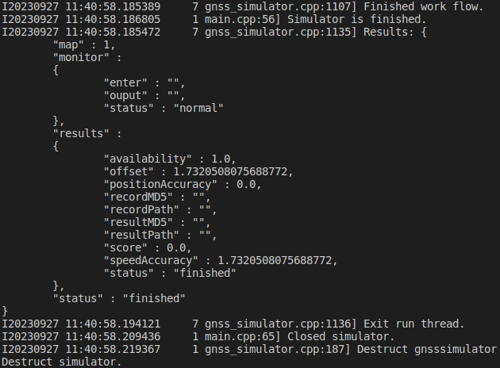
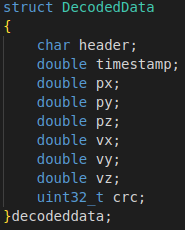
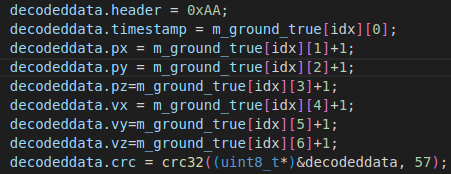

# __自主无人机竞速基本开发教程__  
1. ## 启动模拟器 
    参考 ***自主无人机竞速模拟器使用说明*** 配置好模拟器并启动

2. ## 安装Nvidia-Docker
    >确保已安装了 Nvidia 驱动
    ----
    >安装docker
    >+ `sudo apt-get install ca-certificates gnupg lsb-release`
    >+ `sudo mkdir -p /etc/apt/keyrings`
    >+ `curl -fsSL https://download.docker.com/linux/ubuntu/gpg | sudo gpg --dearmor -o /etc/apt/keyrings/docker.gpg`
    >+ `echo "deb [arch=$(dpkg --print-architecture) signed-by=/etc/apt/keyrings/docker.gpg] https://download.docker.com/linux/ubuntu $(lsb_release -cs) stable" | sudo tee /etc/apt/sources.list.d/docker.list > /dev/null`
    >+ `sudo apt-get update`
    >+ `sudo apt-get install docker-ce docker-ce-cli containerd.io docker-compose-plugin`
    ----
    >安装nvidia-container-toolkit
    >+ `distribution=$(. /etc/os-release;echo $ID$VERSION_ID)`
    >+ `curl -s -L https://nvidia.github.io/nvidia-docker/gpgkey | sudo apt-key add -`
    >+ `curl -s -L https://nvidia.github.io/nvidia-docker/$distribution/nvidia-docker.list | sudo tee /etc/apt/sources.list.d/nvidia-docker.list`
    >+ `sudo apt-get update && sudo apt-get install -y nvidia-container-toolkit`
    >+ `sudo systemctl restart docker`
    ---
    >设置用户组，消除 *sudo* 限制  
    >+ `sudo groupadd docker`  
    >+ `sudo gpasswd -a $USER docker`  
    >+ 注销账户并重新登录使新的用户组生效
    >+ sudo service docker restart

3. ## 安装ROS-Noetic 
    >+ `sudo sh -c 'echo "deb http://packages.ros.org/ros/ubuntu $(lsb_release -sc) main" > /etc/apt/sources.list.d/ros-latest.list'`   
    >+ `sudo apt install curl `  
    >+ `curl -s https://raw.githubusercontent.com/ros/rosdistro/master/ros.asc | sudo apt-key add -`   
    >+ `sudo apt update`
    >+ `sudo apt install ros-noetic-desktop-full`
    >+ `sudo apt install python3-catkin-tools`

4. ## 基于docker镜像的控制程序开发流程
    本次比赛中的模拟器使用 ***ROS*** 进行通讯，选手需要编写含有控制程序的ros功能包操控无人机完成目标,该ros功能包需要封装在docker镜像中进行提交。建议先在主机下开发完相应程序后在进行程序的docker封装，流程如下
    >进入文件目录  
    `cd /path/to/IntelligentUAVChampionshipBase/basic_dev`  
    >开发案例完成功能设计与程序开发并根据需要修改 _Dockerfile_ 后，构建镜像   
    `docker build -t basic_dev .`      
    >导出镜像  
    `docker image save [镜像：TAG] > test.tar`    
    在主机工作目录下会出现 test.tar 文件，该文件即为可提交镜像  
    ### 注意:  
    1. 服务器会在外部随机分配ip给容器，不能在镜像中的启动文件中提供 *ROS_IP* 和 *ROS_MASTER_URI* 这两个环境变量，否则服务器与容器将无法连接     
    2. 镜像中的程序应在镜像启动后自动开启  
    3. 镜像程序不允许使用GUI(X11等)功能，程序案例中的GUI程序仅供调试使用  

5. ## 程序案例
    ### 基础开发环境(basic_dev)
    #### 简介
    该镜像包含有ros-noetic-desktop-focal以及相关的必要ros组件。程序中展示了如何模拟器进行数据交互
    #### 使用说明
    >进入文件目录    
    `cd /path/to/IntelligentUAVChampionshipBase/basic_dev`  
    >构建镜像   
    `docker build -t basic_dev .`  
    >启动docker镜像   
    `./run_basic_dev.sh`  
    >当看到如下图，说明容器启动成功，程序可接受到模拟器传出的数据
    
    ----
    ### 位置控制固定路线巡航(pos_ctrl)
    #### 简介
    该镜像实现了基于速度控制接口的PD控制器。程序会控制无人机沿着一个固定椭圆路径飞行
    #### 使用说明
    >进入文件目录    
    `cd /path/to/IntelligentUAVChampionshipBase/pos_ctrl`  
    >构建镜像   
    `docker build -t pos_ctrl .`  
    >启动docker镜像   
    `./run_posctrl.sh`  
    >当看到如下图，说明容器启动成功，front_left窗口展示无人机的左相机视角，终端中展示无人机的实时位姿，目标位姿与实时速度指令
    
    
    ----
    ### 键盘控制(kb_ctrl)
    #### 简介
    用X11协议获取键盘事件，并基于pd控制器构建的模拟无人机遥控器，实现了无人机的前后左右上下移动以及左右旋转。
    #### 键位说明
    >__q/e__:  &thinsp; &nbsp;&nbsp; &nbsp; &nbsp; &nbsp; 左/右旋转    
    >__w/s__:  &thinsp; &nbsp;&nbsp; &nbsp; &nbsp; &nbsp; 前/后移动  
    >__a/d__:  &thinsp; &nbsp;&nbsp; &nbsp; &nbsp; &nbsp; 左/右移动   
    >__space/f__: &nbsp; 上/下移动  
    >__esc__: &thinsp; &nbsp;&nbsp;&nbsp;&nbsp;&nbsp;&nbsp; &nbsp; 退出键盘控制  
    #### 使用说明
    >进入文件目录    
    `cd /path/to/IntelligentUAVChampionshipBase/kb_ctrl`  
    >构建镜像   
    `docker build -t kb_ctrl .`  
    >启动docker镜像   
    `./run_kbctrl.sh`  
    >当看到如下图，说明容器启动成功，front_left窗口展示无人机的左相机视角，终端中输出键位说明。此时键盘的被占用，仅能够用于控制无人机。当按下esc后键盘被释放
    
    

6. ## ros数据交互
       
    >用于获取数据的可订阅的主题  
    >+ 下视相机   
    `/airsim_node/drone_1/bottom_center/Scene`  
    >+ 双目左rgb图  
    `/airsim_node/drone_1/front_left/Scene`
    >+ 双目右rgb图    
    `/airsim_node/drone_1/front_right/Scene`
    >+ imu数据  
    `/airsim_node/drone_1/imu/imu`
    >+ 无人机状态真值  
    `/airsim_node/drone_1/debug/pose_gt`
    >+ gps数据  
    `/airsim_node/drone_1/pose`
    >+ 障碍圈位姿真值  
    `/airsim_node/drone_1/debug/circle_poses_gt`  
    >+ 障碍圈参考位姿    
    `/airsim_node/drone_1/circle_poses`  
    >+ 赛道中生成的树的真实位置  
    `/airsim_node/drone_1/debug/tree_poses_gt`
    >+ 电机输入PWM信号(0:右前, 1:左后, 2:左前, 3:右后)  
    `/airsim_node/drone_1/rotor_pwm`  
    ----
    >用于发送指令的主题
    >+ 姿态控制  
    `/airsim_node/drone_1/pose_cmd_body_frame` 
    >+ 速度控制   
    `/airsim_node/drone_1/vel_cmd_body_frame`
    >+ 角速度推力控制  
    `/airsim_node/drone_1/angle_rate_throttle_frame`
    ----
    >可用服务   
    >+ 起飞   
    `/airsim_node/drone_1/takeoff`   
    >+ 降落   
    `/airsim_node/drone_1/land`   
    >+ 重置   
    `/airsim_node/reset` 
    ### 注意:   
    服务器仅开放 _下视相机_, _双目左rgb图_, _双目右rgb图_, _gps数据_, _障碍圈参考位姿_, _imu数据_， 规则手册中未提及的话题(_无人机状态真值_, _障碍圈位姿真值_, _赛道中生成的树的真实位置_, _电机输入PWM信号_)仅供调试程序使用。

